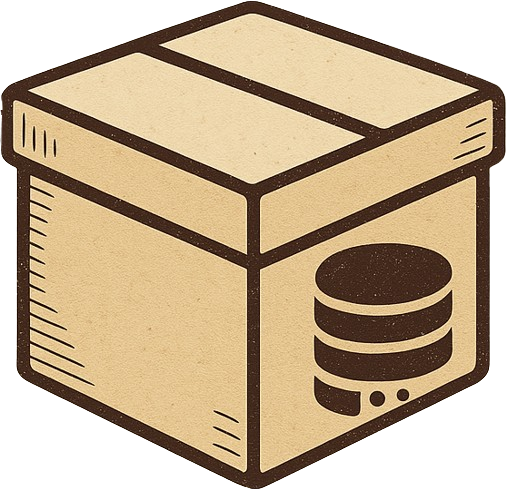

<h1> LiteDBox</h1>

<p align="center">
  <strong>Your alternative lightweight database solution for simplified data management</strong><br>
  <em>Fast • Local • JSON-powered</em>
</p>

<p align="center">
    <a href="#features">✨ Features</a> •
  <a href="#getting-started">🚀 Get Started</a> •
  <a href="#usage">📂 File Format</a> •
  <a href="#license">🙌 Contributing</a>
  <a href="#license">❤️ Support</a>
</p>

---

## 💡 About LiteDBox

**LiteDBox** is a lightweight database solution built for simplicity and efficiency. It runs entirely **locally** using a **JSON file format**, enabling you to manage structured data without setting up a traditional RDBMS.

Whether you're prototyping, building a small app, or learning SQL basics, LiteDBox keeps your workflow fast and flexible.

> ⚠️ Basic SQL knowledge is recommended to get the most out of LiteDBox.

---

## ✨ Features

- ✅ **Simple** – Minimal configuration, intuitive commands
- ⚡ **Lightweight** – Fast performance with low resource usage
- 🔒 **Secure** – Local storage with zero external connections
- 🧠 **Familiar Syntax** – Use SQL-like commands to interact with your data
- 🗃 **Portable** – Runs via a single local file

---

## 🚀 Getting Started

### 1. Installation

Download and install the **LiteDBox SQL Studio Tool** on your device.

### 2. Creating a Database

Launch the tool and create a database with:

```sql
create database db_name
```

### 3. Using Your Database
Select your database for use:

```sql
use db_name
```
> 🔁 Note: You must reselect your database with use db_name each time you open LiteDBox.

### 4. Creating Tables
Define your schema like this:

```sql
create table users (id, name, email)
```

### 5. Working with Data
Retrieve all data:

```sql
select * from users
```
Update a value:

```sql
update users set name = "John" where id = 1
```
Delete a row:
```sql
delete from users where id = 1
```
Drop table or database:
```sql
drop table users
drop database db_name
```

## 🛠 Example
```sql
create database testdb
use testdb
create table tasks (id, title, done)
insert into tasks values (1, "Write README", false)
select * from tasks
```

## 📂 File Format

All data is stored in structured JSON files, offering human-readable and easily portable storage.

## 🙌 Contributing

Contributions are welcome! Feel free to fork the repository, open issues, or submit pull requests.

## ❤️ Support

If you enjoy using LiteDBox, consider starring ⭐ the repo and sharing it with others!

> Made with simplicity in mind.
